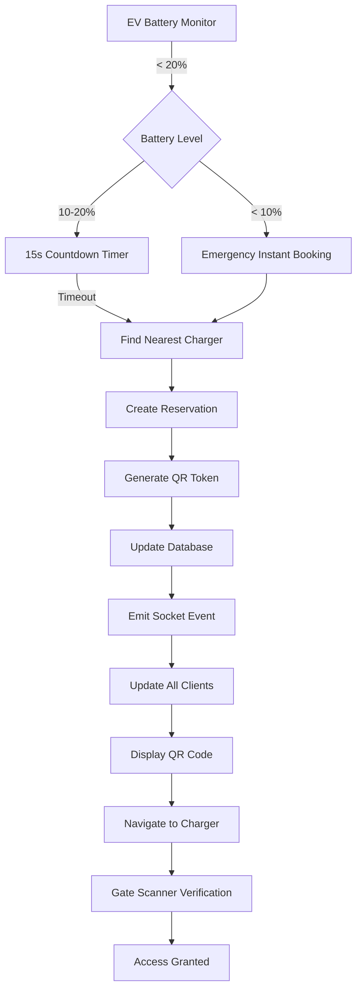

# SMART EV AUTO-RESERVATION PLATFORM


> **Premium Apple/Tesla-Inspired Intelligent EV Charging Management System**

An AI-assisted real-time electric vehicle charging management system that automatically detects low battery, books the nearest charger, handles emergencies, and provides secure QR-based gate access with a premium glassmorphism UI.

---

## 📑 Table of Contents

- [Overview](#-overview)
- [Features](#-features)
- [System Architecture](#-system-architecture)
- [Technology Stack](#-technology-stack)
- [Installation](#-installation)
- [Configuration](#-configuration)
- [Usage](#-usage)
- [API Documentation](#-api-documentation)
- [Database Schema](#-database-schema)
- [Frontend Components](#-frontend-components)
- [Real-time Communication](#-real-time-communication)
- [Security](#-security)
- [Deployment](#-deployment)
- [Development](#-development)
- [Troubleshooting](#-troubleshooting)
- [Contributing](#-contributing)
- [License](#-license)

---

## 🌟 Overview

The Smart EV Auto-Reservation Platform is a comprehensive electric vehicle charging management solution that:

- **Automatically detects low battery** and takes proactive action
- **Auto-books the nearest available charger** without driver intervention
- **Handles emergencies** (<10% battery) with instant reservation
- **Prevents slot conflicts** using real-time synchronization
- **Provides secure QR gate tokens** with HMAC SHA-256 encryption
- **Delivers premium glassmorphism UI** inspired by Apple/Tesla design
- **Ensures 24/7 availability** with automated cleanup scheduler

**The system thinks before the driver does.**

---

## ✨ Features

### 🔋 Battery-Based AI Automation
- **100-21%**: Normal monitoring
- **20%**: Smart reminder with 15-second countdown
- **<10%**: Emergency instant booking with red alert overlay
- **Automatic rerouting**: If charger becomes unavailable

### 🚗 Intelligent Reservation System
- Nearest charger selection using geolocation
- Automatic slot locking and assignment
- QR code generation for gate access
- 15-minute reservation window
- Visual countdown and notifications

### 🔒 Security Features
- HMAC SHA-256 QR token generation
- Server-side token verification
- Tamper-proof gate access control
- Secure credential storage
- Protected API endpoints

### 📱 Premium User Interface
- **Glassmorphism design** with blur effects
- **Live map visualization** using Leaflet
- **Real-time charger availability** indicators
- **Animated EV movement** and charging markers
- **Emergency overlays** for critical situations
- **Smart assistant panel** with AI guidance
- **Responsive design** for all devices

### ⚡ Real-time Synchronization
- Socket.IO for instant updates
- Live charger availability changes
- Automatic UI refresh on reservations
- Multi-client synchronization
- Emergency broadcast notifications

### 🤖 Automated Management
- **60-second cleanup scheduler**
- Expired reservation removal
- Automatic charger release
- Ghost slot prevention
- Database integrity maintenance

---

## 🏗️ System Architecture

```
┌─────────────────────────────────────────────────────────┐
│                    CLIENT (React/Vite)                  │
├─────────────────────────────────────────────────────────┤
│  Components: MapView, BatteryMonitor, ReservationPanel │
│  Router: React Router DOM (/, /admin, /scanner)        │
│  State: React Hooks + Local Storage                    │
│  Real-time: Socket.IO Client                           │
└────────────────┬────────────────────────────────────────┘
                 │ HTTP/WebSocket
┌────────────────┴────────────────────────────────────────┐
│              SERVER (Node.js/Express)                   │
├─────────────────────────────────────────────────────────┤
│  API Routes: /api/chargers, /api/reserve, etc.        │
│  Controllers: Charger, Reservation, Emergency          │
│  Services: ChargerService, Security Utils              │
│  Real-time: Socket.IO Server                           │
│  Scheduler: Auto-cleanup (60s intervals)               │
└────────────────┬────────────────────────────────────────┘
                 │ SQLite3
┌────────────────┴────────────────────────────────────────┐
│                  DATABASE (SQLite)                      │
├─────────────────────────────────────────────────────────┤
│  Tables: chargers, reservations                        │
│  Indexes: charger_id, status, expiry                   │
└─────────────────────────────────────────────────────────┘
```

### System Flow Diagram



---

## 💻 Technology Stack

### Frontend
| Technology | Version | Purpose |
|------------|---------|---------|
| React | 18.2.0 | UI framework |
| Vite | 5.0.0 | Build tool & dev server |
| React Router | 6.20.0 | Client-side routing |
| Leaflet | 1.9.4 | Interactive maps |
| React Leaflet | 4.2.1 | React bindings for Leaflet |
| QRCode.react | 3.1.0 | QR code generation |
| Socket.IO Client | 4.7.2 | Real-time communication |
| Axios | 1.6.0 | HTTP requests |

### Backend
| Technology | Version | Purpose |
|------------|---------|---------|
| Node.js | ≥16.0.0 | Runtime environment |
| Express | 5.2.1 | Web framework |
| Socket.IO | 4.8.3 | WebSocket server |
| SQLite3 | 5.1.7 | Database |
| CORS | 2.8.5 | Cross-origin support |
| QRCode | 1.5.4 | QR generation |

### Design System
- **UI Style**: Glassmorphism
- **Color Scheme**: Dark mode with orange accents
- **Typography**: System fonts (SF Pro / Segoe UI)
- **Animations**: CSS transitions & transforms
- **Layout**: Flexbox & CSS Grid

---

## 📦 Installation

### Prerequisites

- **Node.js** ≥ 16.0.0
- **npm** ≥ 7.0.0 or **yarn**
- **Git**

### Clone Repository

```bash
git clone <repository-url>
cd "EV charging System/z"
```

### Install Dependencies

#### Server Setup
```bash
cd server
npm install
```

#### Client Setup
```bash
cd ../client
npm install
```

### Quick Start

#### 1. Start the Backend Server
```bash
cd server
npm start
```

The server will:
- Initialize SQLite database
- Seed charger data
- Start listening on port 3000 (or 3001-3003 if busy)
- Launch Socket.IO server
- Begin auto-cleanup scheduler

**Expected Output:**
```
🚀 Starting Smart EV Auto-Reservation Platform...
📊 Initializing SQLite database...
✅ Database tables verified
🔌 Checking charger data...
✅ Charger data ready
✅ Port 3000 available
✅ HTTP server created
✅ Socket.IO initialized
✅ API routes configured

╔════════════════════════════════════════════╗
║  🚀 Server running on port 3000           ║
║  📡 Socket.IO: Active                     ║
║  💾 Database: Connected                   ║
║  🔌 Chargers: Seeded                      ║
╚════════════════════════════════════════════╝

🌐 API: http://localhost:3000
🔍 Health Check: http://localhost:3000/health
```

#### 2. Start the Frontend Client
```bash
cd ../client
npm run dev
```

The client will start on `http://localhost:5173`

#### 3. Access the Application

- **Main App**: http://localhost:5173
- **Admin Panel**: http://localhost:5173/admin
- **Gate Scanner**: http://localhost:5173/scanner
- **API Health**: http://localhost:3000/health

---

## ⚙️ Configuration

### Environment Variables

Create `.env` files in both client and server directories:

#### Server `.env`
```env
PORT=3000
NODE_ENV=development
DB_PATH=./database.sqlite
QR_SECRET=your-secret-key-here
RESERVATION_EXPIRY_MINUTES=15
CLEANUP_INTERVAL_MS=60000
```

#### Client `.env`
```env
VITE_API_URL=http://localhost:3000
VITE_SOCKET_URL=http://localhost:3000
VITE_EV_START_LAT=18.5204
VITE_EV_START_LNG=73.8567
```

### Server Configuration

Edit `server/src/config/db.js` for database settings:
```javascript
const dbPath = path.resolve(__dirname, '../../database.sqlite');
```

### Client Configuration

Edit `client/src/config/api.js` for API endpoints:
```javascript
const API_BASE_URL = import.meta.env.VITE_API_URL || 'http://localhost:3000';
```

---

## 🎯 Usage

### User Flow

#### 1. **Main Dashboard**
- View live map with EV position and chargers
- Monitor battery level in top bar
- See smart assistant recommendations

#### 2. **Low Battery (20%)**
- System displays countdown notification
- 15 seconds to manually reserve or auto-reserve
- Can click "RESERVE NOW" to skip countdown

#### 3. **Emergency (<10%)**
- Red emergency overlay appears
- System instantly books nearest charger
- Navigation route displayed automatically

#### 4. **Active Reservation**
- QR code card appears on screen
- Shows charger details and slot number
- Displays expiry countdown
- Route highlighted on map

#### 5. **Gate Access**
- Navigate to `/scanner` page
- Scan QR code at charger location
- System verifies token and grants access

#### 6. **Admin Panel**
- View all chargers and reservations
- Toggle charger availability
- Monitor system status in real-time

---

## 📚 API Documentation

### Base URL
```
http://localhost:3000/api
```

### Endpoints

#### 1. **Get All Chargers**
```http
GET /api/chargers
```

**Response:**
```json
[
  {
    "id": 1,
    "name": "Phoenix Mall Baner",
    "lat": 18.5621,
    "lng": 73.7667,
    "available": 1,
    "type": "public",
    "price_per_unit": 18
  }
]
```

---

#### 2. **Create Reservation**
```http
POST /api/reserve
Content-Type: application/json

{
  "charger_id": 1,
  "ev_id": "EV-AUTO-001"
}
```

**Response:**
```json
{
  "success": true,
  "reservation_id": 5,
  "charger_id": 1,
  "ev_id": "EV-AUTO-001",
  "expiry": "2026-01-12T19:25:00.000Z",
  "qr_code": "data:image/png;base64,...",
  "token_hash": "abc123...",
  "slot": "A-01",
  "lat": 18.5621,
  "lng": 73.7667
}
```

---

#### 3. **Get Reservation Details**
```http
GET /api/reservation/:id
```

**Response:**
```json
{
  "id": 5,
  "charger_id": 1,
  "ev_id": "EV-AUTO-001",
  "expiry": "2026-01-12T19:25:00.000Z",
  "status": "active",
  "slot": "A-01",
  "charger_name": "Phoenix Mall Baner",
  "lat": 18.5621,
  "lng": 73.7667
}
```

---

#### 4. **Emergency Battery Booking**
```http
POST /api/battery-emergency
Content-Type: application/json

{
  "lat": 18.5204,
  "lng": 73.8567,
  "ev_id": "EV-EMERGENCY-001"
}
```

**Response:**
```json
{
  "success": true,
  "emergency": true,
  "reservation_id": 6,
  "charger_id": 2,
  "message": "Emergency reservation created"
}
```

---

#### 5. **Verify QR Code**
```http
POST /api/qr/verify
Content-Type: application/json

{
  "token_hash": "abc123...",
  "charger_id": 1
}
```

**Response:**
```json
{
  "valid": true,
  "message": "Access granted",
  "reservation": {
    "id": 5,
    "ev_id": "EV-AUTO-001",
    "slot": "A-01"
  }
}
```

---

#### 6. **Toggle Charger (Admin)**
```http
POST /api/admin/toggle
Content-Type: application/json

{
  "charger_id": 1,
  "available": 0
}
```

**Response:**
```json
{
  "success": true,
  "charger_id": 1,
  "available": 0
}
```

---

#### 7. **Auto Reroute**
```http
POST /api/auto-reroute
Content-Type: application/json

{
  "old_charger_id": 1,
  "ev_id": "EV-AUTO-001",
  "lat": 18.5204,
  "lng": 73.8567
}
```

**Response:**
```json
{
  "success": true,
  "new_charger_id": 2,
  "message": "Rerouted to new charger"
}
```

---

#### 8. **Health Check**
```http
GET /health
```

**Response:**
```json
{
  "status": "ok",
  "timestamp": "2026-01-12T18:55:00.000Z",
  "database": "connected",
  "socket": "active"
}
```

---

## 🗄️ Database Schema

### Chargers Table
```sql
CREATE TABLE chargers (
    id INTEGER PRIMARY KEY AUTOINCREMENT,
    name TEXT NOT NULL,
    lat REAL NOT NULL,
    lng REAL NOT NULL,
    available INTEGER DEFAULT 1,  -- 1 = available, 0 = occupied
    type TEXT,                    -- 'public' or 'private'
    price_per_unit REAL
);
```

**Sample Data:**
```json
{
  "id": 1,
  "name": "Phoenix Mall Baner",
  "lat": 18.5621,
  "lng": 73.7667,
  "available": 1,
  "type": "public",
  "price_per_unit": 18
}
```

---

### Reservations Table
```sql
CREATE TABLE reservations (
    id INTEGER PRIMARY KEY AUTOINCREMENT,
    charger_id INTEGER NOT NULL,
    ev_id TEXT NOT NULL,
    expiry DATETIME NOT NULL,
    qr_code TEXT,                 -- Base64 encoded QR image
    token_hash TEXT,              -- HMAC SHA-256 hash
    slot TEXT,                    -- Parking slot (e.g., 'A-01')
    status TEXT DEFAULT 'active', -- 'active' or 'expired'
    FOREIGN KEY (charger_id) REFERENCES chargers(id)
);
```

**Sample Data:**
```json
{
  "id": 5,
  "charger_id": 1,
  "ev_id": "EV-AUTO-001",
  "expiry": "2026-01-12T19:25:00.000Z",
  "qr_code": "data:image/png;base64,...",
  "token_hash": "a1b2c3...",
  "slot": "A-01",
  "status": "active"
}
```

---

## 🧩 Frontend Components

### Component Architecture

```
src/
├── App.jsx                      # Main app with routing
├── main.jsx                     # Entry point
├── index.css                    # Global styles
└── components/
    ├── Navbar.jsx               # Top navigation bar
    ├── BatteryMonitor.jsx       # Battery level indicator
    ├── MapView.jsx              # Leaflet map with markers
    ├── ReservationPanel.jsx     # QR code & reservation details
    ├── EmergencyOverlay.jsx     # Red emergency screen
    ├── SmartAssistantPanel.jsx  # AI guidance panel
    ├── SmartTimeline.jsx        # Charging timeline
    ├── AdminPanel.jsx           # Admin dashboard
    ├── GateScanner.jsx          # QR verification page
    └── Sidebar.jsx              # Navigation sidebar
```

### Key Components

#### **App.jsx**
Main application component that manages:
- Battery level state
- Active reservations
- Socket.IO connection
- Emergency flow logic
- Normal reservation flow

#### **MapView.jsx**
Interactive map component featuring:
- Leaflet map integration
- EV position marker
- Charger markers with icons
- Route polyline
- Real-time updates

#### **BatteryMonitor.jsx**
Battery status display with:
- Visual battery indicator
- Percentage display
- Color-coded warnings
- Slider control for testing

#### **ReservationPanel.jsx**
Reservation card showing:
- QR code display
- Charger details
- Slot number
- Expiry countdown
- Close button

#### **EmergencyOverlay.jsx**
Full-screen emergency alert with:
- Red pulsing background
- Warning icon
- Emergency message
- Auto-dismiss after 2s

#### **AdminPanel.jsx**
Administrative interface for:
- Viewing all chargers
- Toggling availability
- Monitoring reservations
- System statistics

#### **GateScanner.jsx**
QR verification page with:
- Token input field
- Verification button
- Success/error messages
- Auto-redirect

---

## 🔌 Real-time Communication

### Socket.IO Events

#### Server → Client Events

**`charger_update`**
```javascript
socket.emit('charger_update', {
  id: 1,
  available: 0
});
```
Sent when charger availability changes.

**`slot_release`**
```javascript
socket.emit('slot_release', {
  charger_id: 1,
  reservation_id: 5
});
```
Sent when reservation expires.

**`emergency_lock`**
```javascript
socket.emit('emergency_lock', {
  charger_id: 2,
  ev_id: 'EV-EMERGENCY-001'
});
```
Sent during emergency booking.

**`reroute`**
```javascript
socket.emit('reroute', {
  old_charger_id: 1,
  new_charger_id: 3
});
```
Sent when auto-rerouting occurs.

#### Client Connection Handling

```javascript
const socket = io('http://localhost:3000');

socket.on('connect', () => {
  console.log('Connected to server');
});

socket.on('charger_update', (data) => {
  // Update charger state
});

socket.on('disconnect', () => {
  console.log('Disconnected from server');
});
```

---

## 🔒 Security

### QR Token Generation

The system uses HMAC SHA-256 for secure token generation:

**Server-side (security.js)**
```javascript
const crypto = require('crypto');

function generateSecureToken(data) {
  const secret = process.env.QR_SECRET || 'default-secret-key';
  const message = JSON.stringify(data);
  return crypto.createHmac('sha256', secret)
    .update(message)
    .digest('hex');
}
```

**Token Structure**
```javascript
{
  charger_id: 1,
  ev_id: "EV-AUTO-001",
  timestamp: "2026-01-12T18:55:00.000Z"
}
```

### Verification Process

1. Client scans QR code
2. Token hash sent to `/api/qr/verify`
3. Server regenerates hash with same data
4. Compares hashes (constant-time comparison)
5. Checks expiry (15 minutes)
6. Returns access granted/denied

### Best Practices

- ✅ Use strong secret key in production
- ✅ Rotate secrets regularly
- ✅ Implement rate limiting on verification
- ✅ Log all access attempts
- ✅ Use HTTPS in production
- ✅ Sanitize all inputs

---

## 🚀 Deployment

### Production Build

#### Frontend
```bash
cd client
npm run build
```
Generates optimized static files in `client/dist/`

#### Backend
```bash
cd server
NODE_ENV=production npm start
```

### Deployment Options

#### **Option 1: Traditional Server (VPS)**

1. Install Node.js on server
2. Clone repository
3. Install dependencies
4. Configure environment variables
5. Use PM2 for process management:

```bash
npm install -g pm2
cd server
pm2 start index.js --name "ev-server"
pm2 save
pm2 startup
```

6. Serve frontend with Nginx:

```nginx
server {
    listen 80;
    server_name yourdomain.com;

    location / {
        root /path/to/client/dist;
        try_files $uri /index.html;
    }

    location /api {
        proxy_pass http://localhost:3000;
        proxy_http_version 1.1;
        proxy_set_header Upgrade $http_upgrade;
        proxy_set_header Connection 'upgrade';
        proxy_set_header Host $host;
    }

    location /socket.io {
        proxy_pass http://localhost:3000;
        proxy_http_version 1.1;
        proxy_set_header Upgrade $http_upgrade;
        proxy_set_header Connection 'upgrade';
    }
}
```

#### **Option 2: Docker**

Create `Dockerfile` for server:
```dockerfile
FROM node:16-alpine
WORKDIR /app
COPY package*.json ./
RUN npm install --production
COPY . .
EXPOSE 3000
CMD ["node", "index.js"]
```

Create `docker-compose.yml`:
```yaml
version: '3.8'
services:
  server:
    build: ./server
    ports:
      - "3000:3000"
    volumes:
      - ./server/database.sqlite:/app/database.sqlite
    environment:
      - NODE_ENV=production
      - QR_SECRET=${QR_SECRET}
  
  client:
    build: ./client
    ports:
      - "80:80"
    depends_on:
      - server
```

Run with:
```bash
docker-compose up -d
```

#### **Option 3: Cloud Platforms**

- **Vercel** (Frontend) + **Render** (Backend)
- **Netlify** (Frontend) + **Railway** (Backend)
- **AWS EC2** + **S3** + **CloudFront**
- **Google Cloud Run**
- **Heroku**

---

## 🛠️ Development

### Project Structure

```
EV charging System/z/
│
├── client/                       # React frontend
│   ├── public/
│   ├── src/
│   │   ├── components/          # React components
│   │   ├── config/              # API configuration
│   │   ├── App.jsx              # Main app
│   │   ├── main.jsx             # Entry point
│   │   └── index.css            # Global styles
│   ├── index.html
│   ├── package.json
│   └── vite.config.js
│
├── server/                       # Node.js backend
│   ├── src/
│   │   ├── config/              # Database config
│   │   ├── controllers/         # Route controllers
│   │   ├── data/                # Seed data
│   │   ├── routes/              # API routes
│   │   ├── services/            # Business logic
│   │   └── utils/               # Utilities
│   ├── database.sqlite          # SQLite database
│   ├── index.js                 # Server entry point
│   └── package.json
│
└── README.md                     # This file
```

### Development Workflow

1. **Create Feature Branch**
```bash
git checkout -b feature/new-feature
```

2. **Make Changes**
- Edit files in `client/src` or `server/src`
- Test changes locally

3. **Test Changes**
```bash
# Client hot reload (auto-refresh)
cd client && npm run dev

# Server (restart after changes)
cd server && npm start
```

4. **Commit Changes**
```bash
git add .
git commit -m "Add new feature"
```

5. **Push & Create PR**
```bash
git push origin feature/new-feature
```

### Adding New Chargers

Edit `server/src/data/chargers.json`:
```json
{
  "name": "New Charger Location",
  "lat": 18.5000,
  "lng": 73.8000,
  "type": "public",
  "price_per_unit": 15
}
```

Restart server to seed new data.

### Styling Guidelines

The project uses CSS custom properties for theming:

```css
:root {
  --primary-orange: #ff8c00;
  --bg-dark: #0a0a0a;
  --glass-bg: rgba(255, 255, 255, 0.05);
  --text-primary: #ffffff;
  --text-secondary: rgba(255, 255, 255, 0.7);
}
```

---

## 🐛 Troubleshooting

### Common Issues

#### **1. Server won't start - Port already in use**
```
⚠️ Port 3000 is busy, trying next...
```
**Solution**: Server automatically tries ports 3001-3003. Or kill process:
```bash
# Windows
netstat -ano | findstr :3000
taskkill /PID <PID> /F

# Linux/Mac
lsof -ti:3000 | xargs kill -9
```

---

#### **2. Frontend can't connect to backend**
```
Error: Network Error
```
**Solution**: Check API URL in `client/src/config/api.js`:
```javascript
const API_BASE_URL = 'http://localhost:3000';
```

---

#### **3. Database errors**
```
Error opening database
```
**Solution**: Delete `database.sqlite` and restart server:
```bash
cd server
rm database.sqlite
npm start
```

---

#### **4. Socket.IO connection failed**
```
WebSocket connection failed
```
**Solution**: 
- Check CORS settings in `server/index.js`
- Verify Socket.IO client connects to correct URL
- Check firewall rules

---

#### **5. QR code verification fails**
```
Invalid token
```
**Solution**:
- Check QR_SECRET matches between generation and verification
- Verify reservation hasn't expired (15 min limit)
- Check system clock synchronization

---

### Debug Mode

Enable verbose logging:

**Server**
```javascript
// server/index.js
app.use((req, res, next) => {
  console.log(`📡 ${req.method} ${req.path}`, req.body);
  next();
});
```

**Client**
```javascript
// client/src/App.jsx
const socket = io({ debug: true });
```

---

## 🤝 Contributing

We welcome contributions! Please follow these guidelines:

### How to Contribute

1. **Fork the repository**
2. **Create feature branch** (`git checkout -b feature/AmazingFeature`)
3. **Commit changes** (`git commit -m 'Add AmazingFeature'`)
4. **Push to branch** (`git push origin feature/AmazingFeature`)
5. **Open Pull Request**

### Code Standards

- Use **ESLint** for JavaScript linting
- Follow **Airbnb JavaScript Style Guide**
- Write **meaningful commit messages**
- Add **comments** for complex logic
- Update **documentation** for new features

### Testing

- Test all changes locally
- Ensure no console errors
- Verify mobile responsiveness
- Check Socket.IO connectivity
- Test emergency flows

---

## 📄 License

This project is licensed under the **MIT License**.

```
MIT License

Copyright (c) 2026 Smart EV Platform

Permission is hereby granted, free of charge, to any person obtaining a copy
of this software and associated documentation files (the "Software"), to deal
in the Software without restriction, including without limitation the rights
to use, copy, modify, merge, publish, distribute, sublicense, and/or sell
copies of the Software, and to permit persons to whom the Software is
furnished to do so, subject to the following conditions:

The above copyright notice and this permission notice shall be included in all
copies or substantial portions of the Software.

THE SOFTWARE IS PROVIDED "AS IS", WITHOUT WARRANTY OF ANY KIND, EXPRESS OR
IMPLIED, INCLUDING BUT NOT LIMITED TO THE WARRANTIES OF MERCHANTABILITY,
FITNESS FOR A PARTICULAR PURPOSE AND NONINFRINGEMENT. IN NO EVENT SHALL THE
AUTHORS OR COPYRIGHT HOLDERS BE LIABLE FOR ANY CLAIM, DAMAGES OR OTHER
LIABILITY, WHETHER IN AN ACTION OF CONTRACT, TORT OR OTHERWISE, ARISING FROM,
OUT OF OR IN CONNECTION WITH THE SOFTWARE OR THE USE OR OTHER DEALINGS IN THE
SOFTWARE.
```

---

## 📞 Support

For questions, issues, or feature requests:

- **GitHub Issues**: [Create an issue](https://github.com/your-repo/issues)
- **Email**: support@smartev.example.com
- **Documentation**: [Full docs](https://docs.smartev.example.com)

---

## 🎯 What Makes This System Unique

✅ **Fully automatic charging** - No manual booking required  
✅ **Emergency AI booking** - Instant reservation for critical battery levels  
✅ **Secure QR gate control** - HMAC SHA-256 encrypted tokens  
✅ **Real-time rerouting** - Automatic charger reassignment  
✅ **Socket-based sync** - Live updates across all clients  
✅ **Automated scheduler** - Self-cleaning expired reservations  
✅ **Luxury UI** - Premium glassmorphism design  

---

## 🌐 System Flow

**EV Boot Location**: Pune, India (18.5204° N, 73.8567° E)

### Battery-Based Automation

| Battery Level | System Action |
|--------------|---------------|
| **100-21%** | Normal monitoring |
| **20%** | Smart reminder with 15s countdown |
| **<10%** | Emergency instant booking |
| **Expired** | Auto release & re-route |

---

## 🎨 Design Philosophy

The UI is inspired by **Apple** and **Tesla** design principles:

- **Minimalism**: Clean, uncluttered interfaces
- **Glassmorphism**: Frosted glass effects with blur
- **Micro-animations**: Smooth transitions and hover effects
- **Dark mode first**: Optimized for low-light viewing
- **Accessibility**: High contrast, readable fonts
- **Responsive**: Mobile-first design approach

---

**Built with ❤️ for the future of electric mobility**
